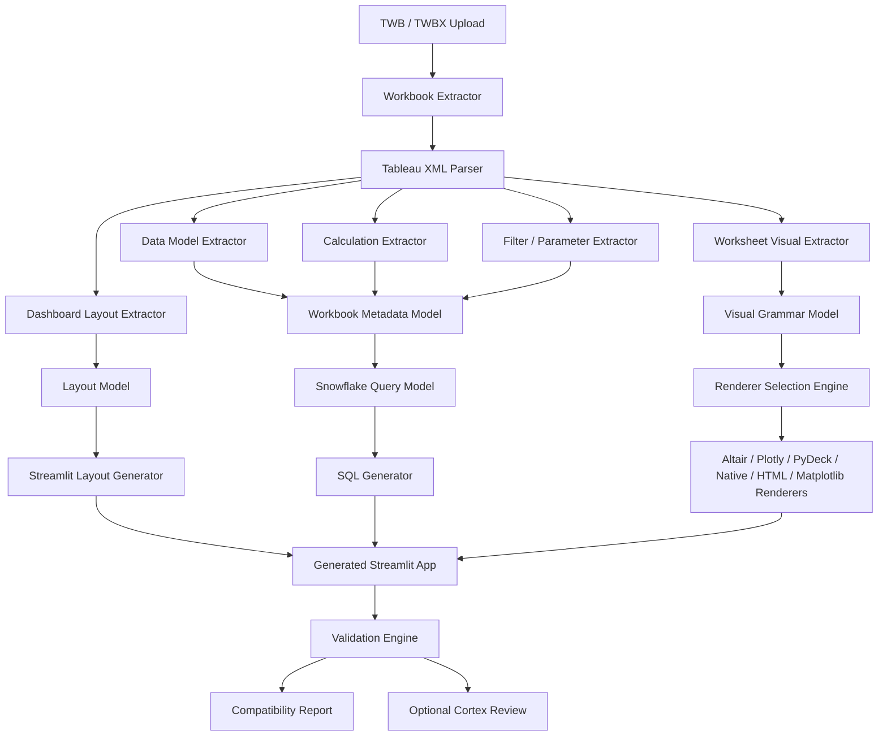
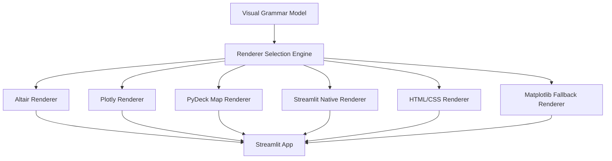

# Tableau to Streamlit in Snowflake Accelerator

## Purpose

Build a deterministic **Tableau to Streamlit in Snowflake accelerator**.

The accelerator should accept Tableau workbooks, parse their structure, extract the semantic model and presentation model, and generate Streamlit in Snowflake applications that recreate at least **90% of the Tableau dashboard experience** for common enterprise dashboards.

This should not be an LLM-first converter. The core conversion should be deterministic and code-driven. Cortex or another LLM may be used only for specific assistive tasks such as complex calculation translation, validation, exception explanation, or visual QA.

The target design is:

```text
Detect close to 100% of relevant workbook features.
Automatically convert the common 90%.
Clearly report the remaining unsupported or partially supported features.
```

## Product Vision

This is not a one-off proof of concept. Build it as a reusable enterprise migration accelerator that can be demonstrated, configured, extended, and eventually pitched to clients.

The accelerator should support three business outcomes:

1. **Assessment**: scan Tableau workbooks and produce a migration-readiness report.
2. **Conversion**: generate working Streamlit in Snowflake apps with high visual and functional fidelity.
3. **Industrialization**: improve over time through reusable conversion rules, renderer plugins, test suites, and client-specific configuration.

The intended client-facing message is:

```text
We provide a deterministic Tableau-to-Streamlit migration accelerator
that analyzes Tableau workbooks, converts supported dashboards into
Streamlit in Snowflake apps, and produces transparent compatibility,
quality, and remediation reports for the remaining gaps.
```

## Product-Grade Design Principles

- Build an accelerator platform, not a script.
- Separate parsing, modeling, rendering, validation, and deployment.
- Keep Tableau parsing deterministic and auditable.
- Store every conversion decision in metadata.
- Treat every unsupported feature as a reported finding, not a silent failure.
- Design for multiple client workbooks, not only Sample Superstore.
- Allow client-specific mapping rules without changing core parser code.
- Use AI only as an optional assistive layer.
- Build a reusable rule library from every manual fix.
- Make generated apps deployable, reviewable, and maintainable by BI engineers.

## Accelerator Capabilities

The accelerator should eventually provide these capabilities:

- Workbook inventory and complexity scoring
- Dashboard migration feasibility scoring
- Data source and calculation inventory
- Tableau feature detection
- Visual conversion
- Streamlit in Snowflake app generation
- Snowflake SQL generation
- Renderer fallback
- Compatibility reporting
- Validation checks
- Optional screenshot-based visual comparison
- Optional Cortex-assisted calculation conversion
- Client-specific configuration profiles
- Reusable migration rule packs
- Deployment artifacts for Snowflake
- Migration summary suitable for client presentations

## Core Principle

Do **not** generate Streamlit directly from raw Tableau XML.

Use this flow:

```text
TWB / TWBX
    -> Tableau Parser
    -> Normalized JSON Models
    -> Renderer Selection Engine
    -> SQL Generator
    -> Streamlit App Generator
    -> Compatibility Report
```

The normalized JSON models are the contract between parsing, conversion, rendering, testing, and future AI-assisted remediation.

## Architecture Diagram



## High-Level Processing Flow

1. Upload or provide a `.twb` file.
2. Parse the Tableau XML.
3. Extract datasources, fields, calculations, parameters, filters, worksheets, dashboards, and layout zones.
4. Convert raw Tableau metadata into normalized JSON models.
5. Build a visual grammar model for every worksheet.
6. Generate Snowflake SQL queries or views.
7. Select the best rendering backend for each visual.
8. Generate a metadata-driven Streamlit app.
9. Generate deployment files for Streamlit in Snowflake.
10. Produce a compatibility and fidelity report.

## Project Structure

Use this modular Python project structure:

```text
tableau_streamlit_accelerator/
    config/
        default_mapping.yml
        renderer_rules.yml
        feature_support_matrix.yml
        client_profiles/
            sample_superstore.yml

    parser/
        twb_parser.py
        twbx_extractor.py
        datasource_parser.py
        worksheet_parser.py
        dashboard_parser.py
        calculation_parser.py
        filter_parser.py
        parameter_parser.py

    models/
        workbook_model.py
        visual_model.py
        layout_model.py
        compatibility_model.py

    converters/
        visual_ir_builder.py
        sql_generator.py
        layout_generator.py
        streamlit_app_generator.py

    renderers/
        renderer_selector.py
        altair_renderer.py
        plotly_renderer.py
        pydeck_renderer.py
        matplotlib_renderer.py
        streamlit_native_renderer.py
        html_renderer.py

    validation/
        compatibility_analyzer.py
        app_validator.py
        visual_regression.py

    rules/
        rule_registry.py
        calculation_rules.py
        visual_rules.py
        layout_rules.py
        snowflake_mapping_rules.py

    templates/
        streamlit_app_template.py.j2
        snowflake_yml_template.j2

    reporting/
        assessment_report_generator.py
        client_summary_generator.py

    deployment/
        snowflake_project_generator.py
        package_builder.py

    tests/
        fixtures/
        golden_outputs/

    cli.py
```

## Configuration-Driven Design

Do not hardcode client-specific assumptions into parser or renderer code.

Use configuration files for:

- Snowflake database, schema, warehouse, and table mappings
- Tableau datasource to Snowflake table mappings
- Field name normalization
- Renderer preferences
- Unsupported feature policy
- Chart color palettes
- Date formatting
- Currency formatting
- Client-specific calculation overrides
- Layout strictness level

Example:

```yaml
client_name: sample_superstore
snowflake:
  database: ANALYTICS
  schema: PUBLIC
  default_table: ORDERS

datasource_mappings:
  "Sample - Superstore":
    table: ORDERS

renderer_preferences:
  default: altair
  map: pydeck
  treemap: plotly

layout:
  mode: balanced
  preserve_dashboard_order: true
  allow_html_css_grid: true

fidelity:
  minimum_target_score: 0.90
```

The same accelerator should run against different clients by changing configuration, not rewriting code.

## CLI Requirement

Provide a command-line interface like:

```bash
python -m tableau_streamlit_accelerator.cli convert \
  --input sample_superstore.twb \
  --snowflake-table ORDERS \
  --output generated_app
```

The CLI should:

- Parse the input workbook.
- Generate metadata JSON files.
- Generate SQL files.
- Generate Streamlit app files.
- Generate compatibility report.
- Exit gracefully if some Tableau features are unsupported.

## Expected Generated Output

The converter should produce:

```text
generated_app/
    streamlit_app.py
    requirements.txt
    snowflake.yml

    metadata/
        workbook_model.json
        visual_model.json
        layout_model.json
        compatibility_report.json
        conversion_decisions.json
        unsupported_features.json

    sql/
        generated_views.sql

    reports/
        migration_assessment.md
        migration_assessment.json
        client_summary.md
```

For client-facing use, the accelerator must produce both technical and business-readable outputs.

Technical outputs:

- Streamlit app code
- SQL
- JSON metadata
- Compatibility details
- Conversion decisions
- Unsupported feature inventory

Client-facing outputs:

- Migration assessment summary
- Estimated conversion fidelity
- Supported vs unsupported feature summary
- Manual remediation list
- Recommended next steps
- Dashboard-by-dashboard readiness score

## Tableau Input Support

### Foundation Release

Support `.twb` files.

`.twb` files are XML-based Tableau workbooks. The parser should use robust XML parsing and handle missing or unknown nodes gracefully.

### Expanded Release

Support `.twbx` files.

`.twbx` files should be handled by:

```text
Unzip TWBX
Find embedded TWB
Parse TWB
Extract packaged assets if needed
Detect local files, images, and extracts
```

Use Python `zipfile` for extraction.

## Parser Requirements

The Tableau parser should extract:

- Workbook name and metadata
- Datasources
- Connections
- Tables
- Joins and relationships where detectable
- Dimensions
- Measures
- Calculated fields
- Parameters
- Worksheets
- Dashboards
- Stories, detected but unsupported in the foundation release
- Filters
- Aliases
- Groups and sets where detectable
- Sorts
- Formatting hints
- Worksheet shelves
- Marks cards
- Tooltips
- Labels
- Colors
- Sizes
- Dashboard zones and layout

Unknown features should not crash the converter. They should be added to the compatibility report.

## Intermediate JSON Models

The converter should generate three primary JSON models.

### 1. Workbook Metadata Model

File:

```text
metadata/workbook_model.json
```

Purpose:

Capture Tableau's semantic and data-layer information.

Example:

```json
{
  "workbook_name": "Sample Superstore",
  "datasources": [
    {
      "name": "Orders",
      "connection_type": "snowflake",
      "tables": [
        {
          "name": "ORDERS",
          "schema": "PUBLIC"
        }
      ],
      "relationships": [],
      "fields": [
        {
          "name": "Sales",
          "caption": "Sales",
          "role": "measure",
          "datatype": "real",
          "default_aggregation": "SUM",
          "table": "ORDERS"
        }
      ],
      "calculated_fields": [
        {
          "name": "Profit Ratio",
          "formula_tableau": "SUM([Profit]) / SUM([Sales])",
          "formula_sql": null,
          "status": "needs_translation"
        }
      ]
    }
  ],
  "parameters": [],
  "worksheets": [],
  "dashboards": []
}
```

### 2. Visual Grammar Model

File:

```text
metadata/visual_model.json
```

Purpose:

Represent every Tableau worksheet as a renderer-independent visual grammar.

This is the most important model for achieving visual fidelity.

Example:

```json
{
  "visuals": [
    {
      "worksheet_name": "Sales by Category",
      "title": "Sales by Category",
      "mark_type": "bar",
      "rows": [
        {
          "field": "Sales",
          "aggregation": "SUM",
          "type": "measure"
        }
      ],
      "columns": [
        {
          "field": "Category",
          "type": "dimension"
        }
      ],
      "x": {
        "field": "Category",
        "type": "nominal"
      },
      "y": {
        "field": "Sales",
        "aggregation": "SUM",
        "type": "quantitative"
      },
      "color": {
        "field": "Segment",
        "type": "nominal"
      },
      "size": null,
      "label": {
        "field": "Sales",
        "aggregation": "SUM",
        "format": "$,.0f"
      },
      "tooltip": [
        "Category",
        "Segment",
        "Sales"
      ],
      "filters": [],
      "sort": [],
      "stacking": true,
      "renderer_preference": null
    }
  ]
}
```

### 3. Layout Model

File:

```text
metadata/layout_model.json
```

Purpose:

Capture Tableau dashboard layout and translate it to Streamlit layout.

Example:

```json
{
  "dashboards": [
    {
      "name": "Executive Dashboard",
      "width": 1200,
      "height": 800,
      "zones": [
        {
          "type": "worksheet",
          "name": "Sales by Category",
          "x": 20,
          "y": 80,
          "w": 500,
          "h": 300
        }
      ],
      "filters": [],
      "parameters": []
    }
  ]
}
```

## Renderer Selection Engine

Do not use only one chart library.

Build a renderer selection engine that chooses the best backend per visual.

Renderer priority:

```text
1. Altair
2. Plotly
3. PyDeck
4. Streamlit native components
5. HTML/CSS
6. Matplotlib fallback
```

### Renderer Selection Diagram



### Renderer Rules

Use **Altair** for:

- Bar charts
- Stacked bar charts
- Line charts
- Area charts
- Heatmaps
- Highlight tables
- Circle/scatter charts
- Layered grammar-of-graphics charts
- Small multiples/facets where possible

Use **Plotly** for:

- Treemaps
- Sunburst charts
- Funnel charts
- Donut charts
- Pie charts
- Advanced interactive charts
- Some map visuals
- Charts where legend, hover, zoom, or business-dashboard behavior is better than Altair

Use **PyDeck** for:

- Latitude/longitude maps
- Point maps
- Density maps
- Geospatial layers where possible inside Streamlit in Snowflake

Use **Streamlit native components** for:

- Tables
- Dataframes
- Metrics
- Filters
- Select boxes
- Sliders
- Date inputs
- Multi-select filters

Use **HTML/CSS** for:

- KPI cards
- BANs
- Dashboard headers
- Tableau-like spacing
- Fine layout control where Streamlit columns are insufficient

Use **Matplotlib** only as fallback for:

- Static visuals
- Unsupported visuals that can be approximated as images
- Cases where Altair/Plotly/PyDeck cannot reproduce the visual acceptably

### Scoring-Based Selection

Implement renderer selection as scoring, not scattered hardcoded if/else.

Example:

```python
def choose_renderer(visual):
    scores = {
        "altair": 0,
        "plotly": 0,
        "pydeck": 0,
        "streamlit_native": 0,
        "html": 0,
        "matplotlib": 0,
    }

    mark_type = visual.get("mark_type")

    if mark_type in {"bar", "line", "area", "circle", "square"}:
        scores["altair"] += 5

    if visual.get("stacking"):
        scores["altair"] += 3
        scores["plotly"] += 2

    if mark_type in {"treemap", "sunburst", "funnel", "pie", "donut"}:
        scores["plotly"] += 6

    if visual.get("geo") or mark_type == "map":
        scores["pydeck"] += 5
        scores["plotly"] += 3

    if mark_type in {"text", "table", "crosstab"}:
        scores["streamlit_native"] += 5

    if mark_type in {"kpi", "ban"}:
        scores["html"] += 5
        scores["streamlit_native"] += 3

    return max(scores, key=scores.get)
```

Each renderer should return a standardized result:

```json
{
  "worksheet_name": "Sales by Category",
  "renderer": "altair",
  "status": "converted",
  "fidelity_score": 0.93,
  "warnings": []
}
```

## Streamlit App Generator Requirements

The generated app should work inside **Streamlit in Snowflake**.

It should:

- Use Snowflake's active Snowpark session where possible.
- Read generated metadata JSON.
- Create sidebar or top-level filters.
- Create dashboard tabs if multiple dashboards exist.
- Render every dashboard using the layout model.
- Render every worksheet using the selected renderer.
- Query Snowflake dynamically.
- Push filters into SQL where possible.
- Avoid loading huge datasets into the frontend.
- Use caching carefully.
- Avoid unsupported external resources.

Use this Snowflake session pattern:

```python
from snowflake.snowpark.context import get_active_session

session = get_active_session()
```

The app should be metadata-driven. Avoid hardcoding each chart unless needed for a fallback.

## SQL Generator Requirements

Generate Snowflake SQL from the visual model and workbook model.

For each worksheet:

```text
SELECT dimension fields
       aggregated measure fields
FROM target Snowflake table/view
WHERE dashboard filters apply
GROUP BY dimension fields
ORDER BY Tableau sort fields
```

Example:

```sql
SELECT
    CATEGORY,
    SEGMENT,
    SUM(SALES) AS SALES
FROM ORDERS
WHERE ORDER_DATE BETWEEN :start_date AND :end_date
GROUP BY CATEGORY, SEGMENT
ORDER BY SALES DESC;
```

Calculated fields should be classified as:

```text
simple      -> deterministic SQL conversion
complex     -> Cortex/manual translation recommended
unsupported -> report clearly
```

## Feature Coverage

### Must Support in the Foundation Release

- Bar charts
- Stacked bar charts
- Line charts
- Area charts
- Scatter/circle charts
- Text tables
- Highlight tables
- Heatmaps
- KPI cards
- Maps where latitude/longitude exists
- Pie/donut charts where present
- Treemaps where present
- Dashboard filters
- Worksheet filters
- Parameters where possible
- Basic calculated fields
- Aggregations: `SUM`, `AVG`, `MIN`, `MAX`, `COUNT`, `COUNTD`
- Sorting
- Color encoding
- Size encoding
- Label encoding
- Tooltip encoding
- Dashboard layout approximation

### Detect But Mark Partial or Unsupported in the Foundation Release

- Complex LOD expressions
- Table calculations
- Advanced dashboard actions
- Stories
- Custom geocoding
- Advanced map layers
- Forecasting
- Analytics pane features
- Complex reference bands/lines
- Sets and groups if not easily parsed
- Complex parameter actions
- Animations
- Tableau extensions
- Custom shapes

The converter must detect these features where possible and write them into the compatibility report.

## Compatibility Report

Generate:

```text
metadata/compatibility_report.json
```

Example:

```json
{
  "overall_estimated_fidelity": 0.91,
  "total_worksheets": 5,
  "fully_supported": 4,
  "partially_supported": 1,
  "unsupported": 0,
  "features": [
    {
      "feature": "Stacked bar chart",
      "status": "supported",
      "renderer": "altair"
    },
    {
      "feature": "LOD calculation",
      "status": "partial",
      "recommendation": "Translate using SQL CTE or Cortex-assisted calculation conversion"
    }
  ],
  "warnings": [],
  "manual_actions": []
}
```

## Validation Requirements

Add validation utilities that compare:

- Number of dashboards parsed vs generated
- Number of worksheets parsed vs generated
- Number of generated charts
- Visual type match
- Axis fields match
- Measure aggregations match
- Filter count match
- Parameter count match
- SQL generated for every visual
- Renderer selected for every visual
- Unsupported features documented

Optional future visual validation:

- Take a screenshot of the Tableau dashboard.
- Take a screenshot of the generated Streamlit dashboard.
- Compare layout similarity.
- Compare chart titles.
- Compare visible labels.
- Compare major colors.
- Compare chart count.

Screenshot comparison should not be mandatory in the foundation release, but the architecture should allow it.

## Cortex / LLM Usage Policy

The converter should not depend on an LLM for primary conversion.

Allowed LLM usage:

- Translate complex Tableau calculations into Snowflake SQL.
- Explain unsupported features.
- Suggest remediation for partially supported features.
- Review visual differences from screenshot comparisons.
- Generate new deterministic rules after a manual/Cortex fix is accepted.

Not allowed:

- Asking the LLM to write the full Streamlit app directly from the TWB.
- Using screenshot-to-code as the primary conversion mechanism.
- Hiding unsupported features instead of reporting them.

## Rule Library Learning Loop

When Cortex or a human fixes an issue, convert the fix into a deterministic reusable rule.

Example:

```text
Issue:
Tableau stacked bar does not match.

Fix:
Use Altair bar chart with color encoding and stack enabled.

Reusable rule:
If mark_type = "bar" and color contains a dimension field, generate stacked bar unless stacking is explicitly disabled.
```

This allows the accelerator to improve over multiple workbooks while reducing LLM dependence.

## Rule Pack Architecture

Create reusable rule packs so the accelerator improves with every project.

Rule packs should be versioned and testable.

Suggested rule pack categories:

```text
rules/
    visual/
        bar_rules.yml
        line_rules.yml
        map_rules.yml
        table_rules.yml
        kpi_rules.yml

    calculation/
        aggregation_rules.yml
        date_rules.yml
        string_rules.yml
        lod_rules.yml

    layout/
        dashboard_zone_rules.yml
        container_rules.yml
        filter_placement_rules.yml

    client/
        client_specific_overrides.yml
```

Each rule should include:

- Rule ID
- Tableau pattern
- Conversion behavior
- Renderer target
- Known limitations
- Test fixture
- Expected output

Example:

```yaml
id: visual.bar.stacked_dimension_color
description: Convert Tableau bar mark with dimension on color to stacked bar.
tableau_pattern:
  mark_type: bar
  color_role: dimension
conversion:
  renderer: altair
  mark: bar
  stack: true
limitations:
  - Does not preserve all Tableau color palettes unless palette mapping exists.
test_fixture: stacked_bar_superstore.twb
```

## Quality Gates

Before a generated app is considered ready for client demonstration, it must pass quality gates.

Minimum quality gates:

- Parser completes without fatal errors.
- All dashboards and worksheets are inventoried.
- Every worksheet has a support status.
- Every generated visual has a selected renderer.
- Every generated visual has SQL or an explicit no-query reason.
- All unsupported features are documented.
- Generated Streamlit app starts successfully.
- Compatibility report is generated.
- Overall estimated fidelity score is calculated.
- Dashboard-level fidelity scores are calculated.

Recommended production quality gates:

- Unit tests pass for parser, renderer selector, SQL generator, and report generator.
- Golden-output tests pass for known Tableau workbooks.
- Generated SQL passes syntax validation.
- Generated app passes a smoke test.
- Optional screenshot comparison passes configured threshold.
- No unsupported critical feature is hidden.

## Testing Strategy

Build a regression test suite from real workbook fixtures.

Test categories:

- Parser tests
- Visual grammar extraction tests
- Calculation translation tests
- SQL generation tests
- Renderer selection tests
- Streamlit app generation tests
- Compatibility report tests
- Golden-output tests

Golden-output testing is important. For each known workbook, store expected JSON models and compare future runs against them.

Example:

```text
tests/
    fixtures/
        sample_superstore.twb
        stacked_bar_dashboard.twb
        map_dashboard.twb

    golden_outputs/
        sample_superstore/
            workbook_model.json
            visual_model.json
            layout_model.json
            compatibility_report.json
```

## Reference Implementation Target

Use Sample Superstore as the first reference implementation because it is familiar, easy to explain, and contains common dashboard patterns.

Do not hardcode the accelerator for Sample Superstore. Use it only as the first repeatable validation workbook.

Optimize first for a Sample Superstore dashboard with around five sheets:

- Sales by Category
- Sales by Sub-Category
- Profit by Region
- Sales Trend by Order Date
- Customer, Segment, Region filters
- KPI cards
- Map or circle/scatter visual if present
- Stacked bar chart

The generated Streamlit app should visually match Tableau as closely as possible using:

- Altair
- Plotly
- PyDeck
- Streamlit native components
- HTML/CSS
- Matplotlib fallback

## Client Demonstration Flow

The accelerator should support a clean client-facing demo flow.

Recommended demo sequence:

1. Show the original Tableau dashboard.
2. Upload or point the accelerator to the Tableau workbook.
3. Run workbook assessment.
4. Show parsed workbook inventory:
   - dashboards
   - worksheets
   - datasources
   - calculations
   - filters
   - unsupported features
5. Show estimated migration fidelity score.
6. Run conversion.
7. Open the generated Streamlit in Snowflake app.
8. Compare dashboard layout and visuals.
9. Show compatibility report and manual remediation list.
10. Explain how the same pipeline scales to more workbooks.

Client-facing demo message:

```text
This accelerator does not hide migration complexity.
It discovers the Tableau workbook, converts what can be converted
deterministically, and gives a transparent view of what needs review.
```

## Enterprise Readiness Requirements

For a client-pitchable accelerator, include these non-functional requirements:

- Deterministic execution
- Repeatable outputs
- Clear logs
- Versioned rule packs
- Configurable client mappings
- No hidden AI dependency
- Generated code that can be reviewed by client engineers
- Compatibility reports suitable for migration planning
- Support for batch assessment of multiple workbooks
- Ability to run in local development and Snowflake-oriented deployment workflows
- Clean separation between accelerator code and generated app code
- Secure handling of connection metadata
- No secrets written into generated files

## Batch Assessment Mode

Add a batch mode for enterprise migration planning.

Example:

```bash
python -m tableau_streamlit_accelerator.cli assess-folder \
  --input-folder tableau_workbooks \
  --output assessment_output
```

Batch mode should produce:

- Workbook inventory
- Dashboard count
- Worksheet count
- Datasource count
- Calculation count
- Feature complexity score
- Estimated migration effort
- Estimated automatic conversion percentage
- Unsupported feature summary
- Prioritized migration order

Example output:

```text
assessment_output/
    portfolio_summary.md
    portfolio_summary.json
    workbooks/
        sales_dashboard/
            compatibility_report.json
            migration_assessment.md
        finance_dashboard/
            compatibility_report.json
            migration_assessment.md
```

## Accelerator Roadmap

### Release 1: Foundation Converter

Goal:

Build the core parser, metadata models, renderer selector, app generator, and compatibility reporting.

Primary success criteria:

- Sample Superstore reference dashboard converts successfully.
- Common visuals reach high fidelity.
- Unsupported features are clearly reported.

### Release 2: Enterprise Assessment

Goal:

Support batch scanning of multiple Tableau workbooks.

Primary success criteria:

- Portfolio-level migration reports are generated.
- Workbooks are ranked by conversion complexity.
- Client can identify quick wins and difficult dashboards.

### Release 3: Rule Library Expansion

Goal:

Improve deterministic conversion coverage using reusable rule packs.

Primary success criteria:

- More visual types and calculations are supported.
- Manual fixes become reusable rules.
- Regression tests prevent older conversions from breaking.

### Release 4: Visual QA

Goal:

Add optional screenshot-based comparison between Tableau and generated Streamlit.

Primary success criteria:

- Layout similarity is scored.
- Visual differences are reported.
- Cortex can optionally explain differences, but does not perform core conversion.

### Release 5: Production Packaging

Goal:

Package the accelerator for repeated internal or client delivery.

Primary success criteria:

- Standard installation process.
- Standard configuration templates.
- Standard client demo flow.
- Standard assessment reports.
- Standard generated app structure.

## Implementation Phases

### Phase 1: Parser and Inventory

Build TWB parser and generate:

- `workbook_model.json`
- Basic workbook inventory
- Compatibility report with detected features

Success criteria:

- Parser does not crash on unknown nodes.
- Datasources, fields, calculations, worksheets, dashboards, and filters are detected.

### Phase 2: Visual Grammar Model

Build worksheet visual extraction.

Success criteria:

- Each worksheet becomes a normalized visual grammar object.
- Rows, columns, marks, color, size, label, tooltip, filters, sort, and aggregation are captured.

### Phase 3: SQL Generation

Generate Snowflake SQL per worksheet.

Success criteria:

- Basic aggregations work.
- Filters are pushed into SQL.
- Calculated fields are classified.

### Phase 4: Renderer Selection and Rendering

Build Altair, Plotly, PyDeck, native Streamlit, HTML, and Matplotlib renderers.

Success criteria:

- Each visual gets a selected renderer.
- Common Sample Superstore charts render correctly.
- Renderer output is standardized.

### Phase 5: Streamlit App Generation

Generate a deployable Streamlit in Snowflake app.

Success criteria:

- `streamlit_app.py` runs in Snowflake.
- App reads metadata JSON.
- Dashboards and charts render from metadata.

### Phase 6: Validation and Reporting

Build compatibility and validation reports.

Success criteria:

- Supported, partial, and unsupported features are clearly documented.
- Estimated fidelity score is produced.

## Final Engineering Goal

Build a deterministic migration accelerator with:

- Tableau workbook parsing
- Normalized metadata models
- Visual grammar conversion
- Renderer fallback
- Snowflake SQL generation
- Streamlit in Snowflake app generation
- Compatibility scoring
- Optional Cortex-assisted remediation

The correct enterprise positioning is:

```text
This is a deterministic Tableau-to-Streamlit migration accelerator
with renderer fallback and compatibility scoring.
It uses AI only for exception handling and validation,
not as the core conversion engine.
```
